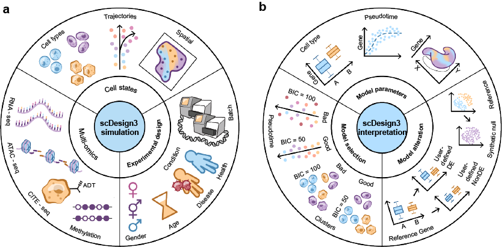

## scDesign3

------------------------------------------------------------------------

The R package **scDesign3** is an all-in-one single-cell data simulation tool by using reference datasets with different cell states (cell types, trajectories or and spatial coordinates), different modalities (gene expression, chromatin accessibility, protein abundance, DNA methylation, etc), and complex experimental designs. The transparent parameters enable users to alter models as needed; the model evaluation metrics (AIC, BIC) and convenient visualization function help users select models. Detailed tutorials that illustrate various functionalities of scDesign3 are available at this [website](https://songdongyuan1994.github.io/scDesign3/docs/index.html). The following illustration figure summarizes the usage of scDesign3:

{width="600"}

To find out more details about **scDesign3**, you can check out our manuscript on Nature Biotechnology:

[Song, D., Wang, Q., Yan, G. et al. scDesign3 generates realistic in silico data for multimodal single-cell and spatial omics. <em>Nat Biotechnol</em> (2023).](https://www.nature.com/articles/s41587-023-01772-1)

## Installation

To install the development version from GitHub, please run:

``` r
if (!require("devtools", quietly = TRUE))
    install.packages("devtools")
devtools::install_github("SONGDONGYUAN1994/scDesign3")
```

We are now working on submitting it to Bioconductor and will provide the link once online.

## Quick Start

The following code is a quick example of running our simulator. The function `scdesign3()` takes in a `SinglecellExperiment` object with the cell covariates(such as cell types, pesudotime, or spatial coordinates) stored in the `colData` of the `SinglecellExperiment` object. For more details on the `SinlgeCellExperiment` object, please check on its [Bioconductor link](https://bioconductor.org/packages/release/bioc/html/SingleCellExperiment.html).

``` r
example_simu <- scdesign3(
    sce = example_sce,
    assay_use = "counts",
    celltype = "cell_type",
    pseudotime = "pseudotime",
    spatial = NULL,
    other_covariates = NULL,
    mu_formula = "s(pseudotime, k = 10, bs = 'cr')",
    sigma_formula = "s(pseudotime, k = 5, bs = 'cr')",
    family_use = "nb",
    n_cores = 2,
    usebam = FALSE,
    corr_formula = "1",
    copula = "gaussian",
    fastmvn = FALSE,
    DT = TRUE,
    pseudo_obs = FALSE,
    family_set = c("gauss", "indep"),
    important_feature = rep(TRUE, dim(sce)[1]),
    nonnegative = TRUE,
    return_model = FALSE,
    nonzerovar = FALSE,
    parallelization = "mcmapply",
    BPPARAM = NULL，
    trace = FALSE
  )
```

The parameters of `scdesign3()` are:

- `sce`: A SingleCellExperiment object.
- `assay_use`: A string which indicates the assay you will use in the sce. Default is 'counts'.
- `celltype`: A string of the column name of the cell type variable in the colData of the sce. Default is 'cell_type'. The cell type variable in the colData of the sce should be a factor variable. Use NULL if there is no column in the colData that contains the cell-type information. 
- `pseudotime`: A string or a string vector of the name of pseudotime and (if exist) multiple lineages. Default is NULL. If the data only has one lineage, then this parameter should be the column name of the pesudotime variable in the colData of the sce. If the data has multiple lingaes, then this parameter be the column names of the pseudotime variables for each lineage and the vaiables indicating which lineage that a cell belongs to. The pseudotime variables should be continuous numeric variables.
- `spatial`: A length-two string vector of the column names of spatial coordinates in the colData of sce. Defualt is NULL. 
- `other_covariate`: A string or a string vector of the other covariates in the colData of sce you want to include in the data. For example, you can put the column names of the batch variables and/or condition variables in the colData of sce here if your sce contains these information and you want to include these variables in`mu_formula` or `sigma_formula` or `corr_formula`.
- `mu_formula`: A string of the mu parameter formula for fitting each gene's marginal distribution.
- `sigma_formula`: A string of the sigma parameter formula for fitting each gene's marginal distribution.
- `family_use`: A string of the marginal distribution you want to use when fitting each gene's marginal distribution. Must be one of 'poisson', 'nb', 'zip', 'zinb' or 'gaussian'.
- `n_cores`: An integer. The number of cores to use.
- `usebam`: A logic variable. If use bam (generalized additive models for very large datasets
) for acceleration.
- `corr_formula`: A string of the correlation structure. For example, if you want to obtain a correlation structure for each cell type, then this parameter should be the column name of the cell type variable in the colData of sce.
- `copula`: A string of the copula choice. Must be one of 'gaussian' or 'vine'. Default is 'gaussian'. Note that vine copula may have better modeling of high-dimensions, but can be very slow when features are >1000.
- `fastmvn`: An logical variable. If TRUE, the sampling of multivariate Gaussian is done by mvnfast, otherwise by mvtnorm. Default is FALSE. It only matters for Gaussian copula.
- `DT`: A logic variable. If TRUE, perform the distributional transformation to make the discrete data 'continuous'. This is useful for discrete distributions (e.g., Poisson, NB). Default is TRUE. Note that for continuous data (e.g., Gaussian), DT does not make sense and should be set as FALSE.
- `pseudo_obs`: A logic variable. If TRUE, use the empirical quantiles instead of theoretical quantiles for fitting copula. Default is FALSE.
- `family_set`: A string or a string vector of the bivariate copula families. Default is c("gauss", "indep").
- `important_feature`: A string or vector which indicates whether a gene will be used in correlation estimation or not. If this is a string, then this string must be "auto", which indicates that the genes will be automatically selected based on the proportion of zero expression across cells for each gene. Gene with zero proportion greater than 0.8 will be excluded form gene-gene correlation estimation. If this is a vector, then this should be a logical vector with length equal to the number of genes in sce. TRUE in the logical vector means the corresponding gene will be included in gene-gene correlation estimation and FALSE in the logical vector means the corresponding gene will be excluded from the gene-gene correlation estimation. The default value for is a vector with length equal to the number of inputted genes and every value equals to TRUE.
- `nonnegative`: A logical variable. If TRUE, values < 0 in the synthetic data will be converted to 0. Default is TRUE (since the expression matrix is nonnegative).
- `return_model`: A logic variable. If TRUE, the marginal models and copula models will be returned. Default is FALSE.
- `nonzerovar`: A logical variable. If TRUE, for any gene with zero variance, a cell will be replaced with 1. This is designed for avoiding potential errors, for example, PCA.
- `parallelization`: A string indicating the specific parallelization function to use. Must be one of 'mcmapply', 'bpmapply', or 'pbmcmapply', which corresponds to the parallelization function in the package parallel,BiocParallel, and pbmcapply respectively. The default value is 'mcmapply'.
- `BPPARAM`: A MulticoreParam object or NULL. When the parameter parallelization = 'mcmapply' or 'pbmcmapply', this parameter must be NULL. When the parameter parallelization = 'bpmapply', this parameter must be one of the MulticoreParam object offered by the package 'BiocParallel. The default value is NULL.
- `TRACE`: A logic variable. If TRUE, the warning/error log and runtime for gam/gamlss will be returned, FALSE otherwise. Default is FALSE.

The output of `scdesign3()` is a list which includes:

-   `new_count`: This is the synthetic count matrix generated by `scdesign3()`.
-   `new_covariate`:
    -   If the parameter `ncell` is set to a number that is different from the number of cells in the input data, this will be a matrix that has the new cell covariates that are used for generating new data.
    -   If the parameter `ncell` is the default value, this will be `NULL`.
-   `model_aic`: This is a vector include the genes' marginal models' AIC, fitted copula's AIC, and total AIC, which is the sum of the previous two.
-   `model_bic`: This is a vector include the genes' marginal models' BIC, fitted copula's BIC, and total BIC, which is the sum of the previous two.
-   `marginal_list`:
    -   If the parameter `return_model` is set to `TRUE`, this will be a list which contains the fitted gam or gamlss model for all genes in the input data. This may greatly increase the object size.
    -   If the parameter `return_model` is set to the default value `FALSE`, this will be `NULL`.
-   `corr_list`:
    -   If the parameter `return_model` is set to `TRUE`, this will be a list which contains either a correlation matrix (when `copula = "gaussian"`) or the fitted Vine copula (when `copula = "vine"`) for each user specified correlation groups (based on the parameter `corr_by`).
    -   If the parameter `return_model` is set to the default value `FALSE`, this will be `NULL`.

## Tutorials

For all detailed tutorials, please check the [website](https://songdongyuan1994.github.io/scDesign3/docs/index.html). The tutorials will demonstrate the applications of **scDesign3** from the following four perspectives: data simulation, model parameters, model selection, and model alteration.

-   Data simulation
    -   scDesign3 introduction
    -   Simulate datasets with cell library size
    -   Simulate datasets with multiple lineages
    -   Simulate spatial transcriptomic data
    -   Simulate spot-resolution spatial data for cell-type deconvolution
    -   Simulate single-cell ATAC-seq data
    -   Simulate CITE-seq data
    -   Simulate multi-omics data from multiple single-omic datasets
    -   Simulate datasets with batch effect
    -   Simulate datasets with condition effect
-   Model parameter
    -   scDesign3 introduction
    -   scDesign3 marginal distribution for genes
    -   Compare Gaussian copula and Vine copula
-   Model selection
    -   Evaluate clustering goodness-of-fit by scDesign3
    -   Evaluate pseudotime goodness-of-fit by scDesign3
-   Model alteration
    -   Simulate datasets with/without batch effect
    -   Simulate datasets with/without condition effect
    -   Simulate datasets for DE test

## Contact

Any questions or suggestions on `scDesign3` are welcomed! Please report it on [issues](https://github.com/SONGDONGYUAN1994/scDesign3/issues), or contact Dongyuan Song ([dongyuansong\@ucla.edu](mailto:dongyuansong@ucla.edu){.email}) or Qingyang Wang ([qw802\@g.ucla.edu](mailto:qw802@g.ucla.edu){.email}).

## Related Manuscripts

-   The predecessors of **scDesign3**
    -   **scDesign**: [Li, W. V., & Li, J. J. (2019). A statistical simulator scDesign for rational scRNA-seq experimental design. Bioinformatics, 35(14), i41-i50.](https://academic.oup.com/bioinformatics/article/35/14/i41/5529133)
    -   **scDesign2**: [Sun, T., Song, D., Li, W. V., & Li, J. J. (2021). scDesign2: a transparent simulator that generates high-fidelity single-cell gene expression count data with gene correlations captured. Genome biology, 22(1), 1-37.](https://link.springer.com/article/10.1186/s13059-021-02367-2)
-   The simulator for single-cell multi-omics reads developed by our lab memeber Guanao Yan
    -   **scReadSim**: [Yan, G., & Li, J. J. (2022). scReadSim: a single-cell multi-omics read simulator. bioRxiv.](https://www.biorxiv.org/content/10.1101/2022.05.29.493924v1.abstract)
